# Docker
## Instalasi Docker Engine
Untuk langkah-langakh menginstall docker adalah sebagai berikut, atau anda juga dapat membuka melalui [Docker Docs](https://docs.docker.com/engine/install/debian/)

1. Uninstall terlebih dahulu versi terdahulu docker yang sudah pernah terintall, maupun package yang mungkin menimbulkan konflik menggunakan
    for pkg in docker.io docker-doc docker-compose podman-docker containerd runc; do sudo apt-get remove $pkg; done

2. Siapkan repository dengan melakukan update serta menambahkan GPG key official Docker
    sudo apt-get update
    sudo apt-get install ca-certificates curl
    sudo install -m 0755 -d /etc/apt/keyrings
    sudo curl -fsSL https://download.docker.com/linux/debian/gpg -o /etc/apt/keyrings/docker.asc
    sudo chmod a+r /etc/apt/keyrings/docker.asc

3. Kemudian, tambahkan repository Apt sources
    echo \
        "deb [arch=$(dpkg --print-architecture) signed-by=/etc/apt/keyrings/docker.asc] https://download.docker.com/linux/debian \
        $(. /etc/os-release && echo "$VERSION_CODENAME") stable" | \
        sudo tee /etc/apt/sources.list.d/docker.list > /dev/null
    sudo apt-get update

4. Install packege Docker-nya
    sudo apt-get install docker-ce docker-ce-cli containerd.io docker-buildx-plugin docker-compose-plugin

5. Pastikan Docker sudah terinstall dengan sempurna, jalankan perintah di bawah ini
    sudo docker run hello-world

Jika sudah berhasil, maka akan muncul sebagai berikut
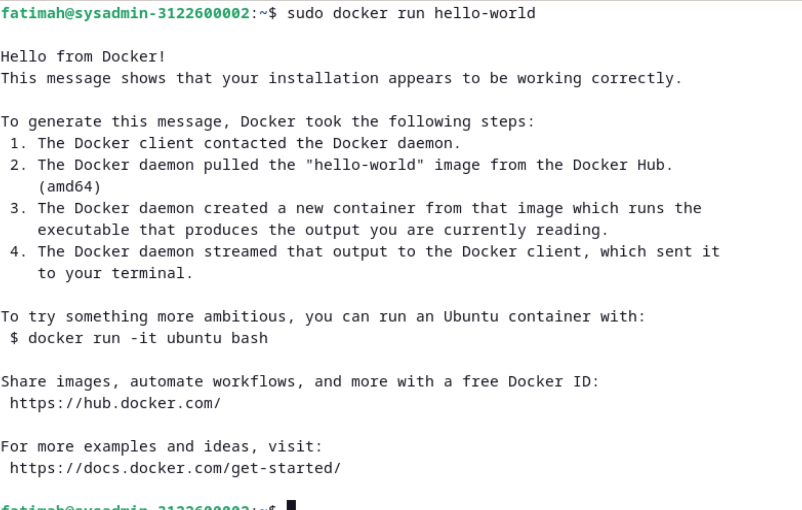

## Example
Kita akan membuat image sendiri yang akan kita beri nama example. Juga dapat digunakan langsung file dari github [ini](https://github.com/alfiyansys/docker-examples). 

1. Pertama kita buat file dengan nama *Dockerfile* dengan isi sebagai berikut:
    from nginx:alpine

    COPY . /usr/share/nginx/html
    EXPOSE 80

    CMD ["nginx", "-g", "daemon off;"]

2. Buat file bernama *index.html* dengan sisi sebagai berikut:
    Hello, C307!

3. Jalanakan perintah berikut untuk membangun menjadi sebuah docker image. Pastikan anda berada di directory letak file Dockerfile dan index.html yang sudah anda buat. di sini kita beri nama container kita *example*
    sudo docker build -t example .
Proses ini dapat memakan waktu yang cukuo lama, ditunggu saja.
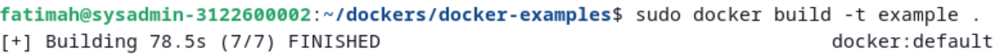

4. Jalankan Docker yang barusan dibuat  emnggunakan docker run sebagai berikut setelah proses build selesai
    sudo docker run -p 3000:80
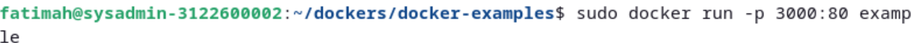

5. Buka port 80 pada localhost anda melalui browser
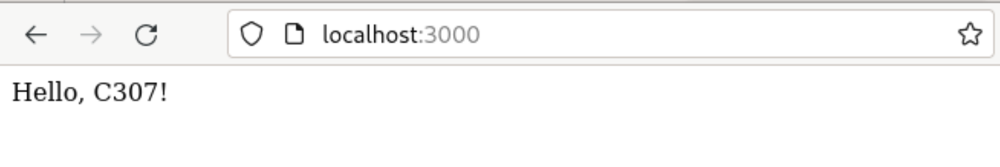

## Uptime-Kuma
Disini kita akan menjalankan sebuah self-hosted monitoring-tool yaitu [uptime-kuma](https://github.com/louislam/uptime-kuma). 

1. Pertama-tama, kita salin repository uptime kuma menggunakan git
    git clone https://github.com/louislam/uptime-kuma.git

2. Pastikan sudah masuk ke dalam directory tempat kita menyalin repository tersebut.
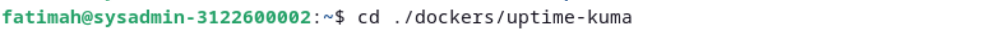

3. Jalankan perintah berikut, waktu proses untuk berjalanny adapat emmakan waktu yang sangat lama
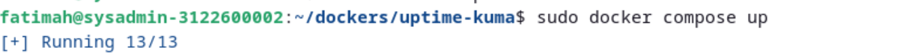

4. Cek Port tempat uptime-kuma berjalan, yaitu 3001, anda mungkin akan diminta untuk membuat akun terlebih dahulu. Jika berhasil, maka akan mendapat tampilan seperti berikut.
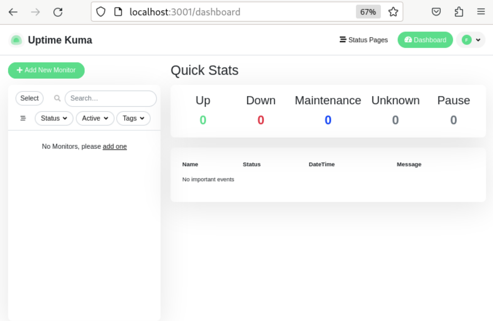

**Untuk dapat menggunakan url milik sendiri(monitoring.kelompok1.local), Perlu diperhatikan langkah-langkah berikut**

5. Konfigurasi file db.kelompok1.local dan tambahkan sebuah CNAME ns bernama monitoring
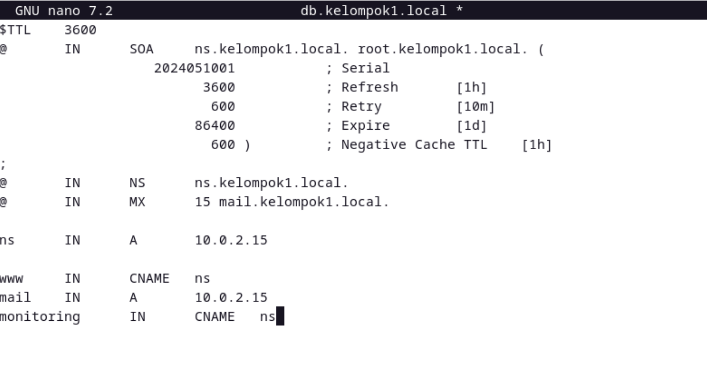

6. Restart named untuk menjalankan hasil perubahan
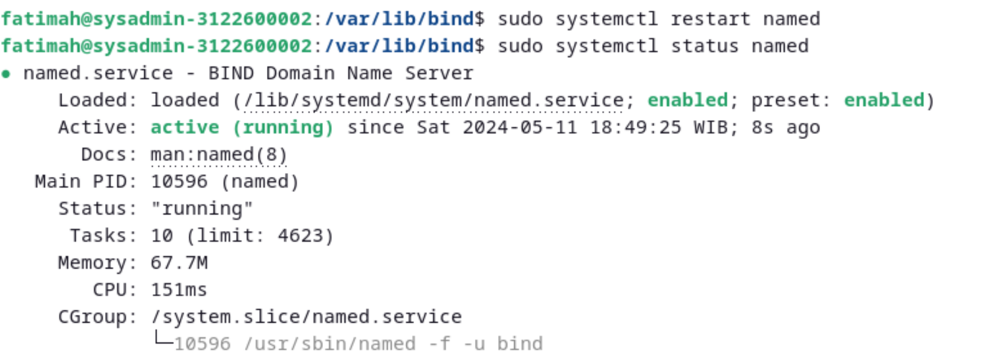

7. Tambahkan beberapa package pada apache2 kita yang memungkinkan kita untuk menggunakan ReverseProxy
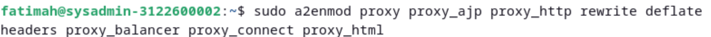

8. Lakukan konfigurasi pada file 00-default.conf dari apache1/sites-enabled
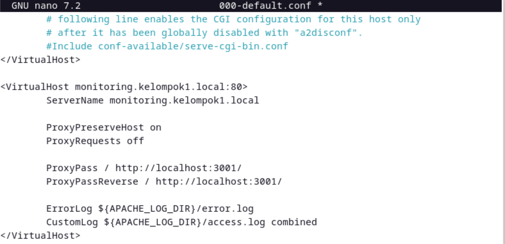

9. Simpan perubahan dan lakukan restart pada apache2 untuk dapat menggunakan package yang baru ditambahkan dan menjalakan oerubahan
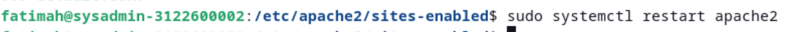

10. Jika sudah benar, dapat kita akses uptime-kuma menggunakan url monitoring.kelompok1.local
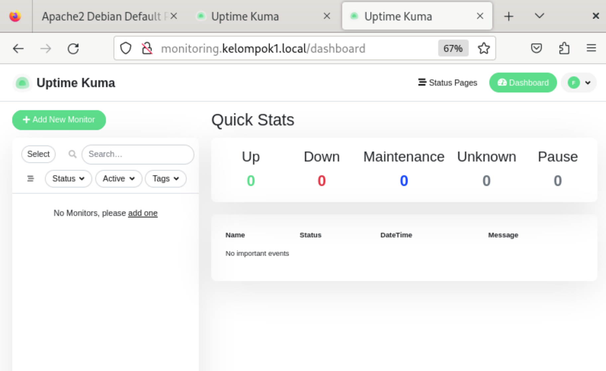