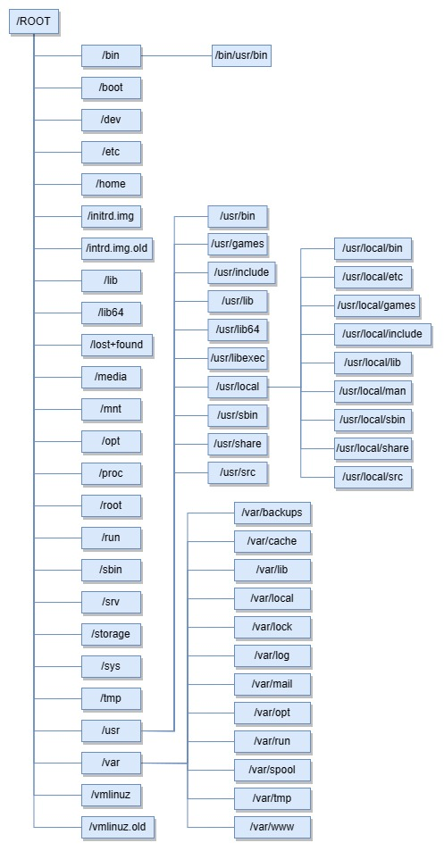

# Linux Directory

Salah satu perbedaam yang paling mencolok dari Linux dan Windows terletak pada struktur direktorinya. Tidak hanya formatnya yang berbeda tetapi cara mengakses direktorinya.

Di dalam Windows, format yang digunakan untuk mengakses direktori adalah sebagai berikut:
D:\Folder\subfolder\file.txt
Sedangkan di dalam Linux, format yang digunakan adalah sebagai berikut:
/Folder/subfolder/file.txt

Yang pertama bisa kita lihat dari tanda slash keduanya. Linux menggunakan slash (/) dan Windows menggunakan backslask (\). Selain itu, di dalam Linux tidak ada drive C:, D:, dll seperti Windows.  Saat booting, partisi root pada Linux akan ter-mount pada /.. Semua file, folders, devices, dan drive, akan mounted /. Penting untuk dicatat bahwa penulisan file dan folder pada Linux sangat case sensitive.

Contoh :
/Folder/subfolder/file.txt tidak sama dengan /folder/subfolder/file.txt

## Overview

Struktur Direktori Unix dan Linux adalah satu kesatuan (unified) Sturuktur Direktori under / Root file system. 
Ketika file system mounted secara fisik, seluruh Direktori akan tersusun secara bertingkat di dalam Root file system.

Struktur direktori pada Linux mengacu pada Filesystem Hierarchy Structure (FHS) yang di maintain oleh Free Standards Group dan banyak distribusi yang cenderung menyimpang dari standar tersebut.

## Hirarki Struktur Direktori

### / (Root)
Struktur Direktori dimulai dari Root File System "/". Partisi di dalam root akan diletakkan pada UNIX atau UNIX-Compatible System

### /boot
Direktori ini berisi Boot loader files, meliputi :
GRUB, Lilo, kernel, initrd, system.map config

### /sys
Direktori ini berisi kernal, firmware, dan file system.

### /sbin
Direktori ini berisi Binaries System dan Administration System tool yang penting untuk sistem operasi dan performanya.

### /bin
Direktori ini berisi binaries untuk user dan beberapa hal yang dibutuhkan di single user mode. Contohnya : cat, ls, cp, dll.

### /lib
Direktori ini berisi file library untuk semua binaries dari /sbin dan /bin

### /dev
Berisi file system dan drivers

### /etc
Berisi sistem konfigurasi termasuk :
/etc/hosts, /etc/resolv.conf, nsswitch.conf, defaults, dan network configuration. Contoh di atas merupakan host specific system dan file configuration application.

### /home
Semua direktori home milik user berada di direktori ini kecuali direktori root home. Direktori root home tetap berada di direktori /root.
Direktori ini berisi file milik user, personal setting seperti .profile, dan lain-lain.

### /media
Direktori ini berisi mount point untuk removable media seperti CD-ROM, USB, floppies, dan lain-lain.

### /mnt
Berisi mount point untuk file sytem sementara untuk mempermudah saat ada troubleshooting dengan CDROM misalnya, dimana kita bisa mount file sistem Root dan mengatur konfigurasinya,

### /usr
Data direktori dari user yang merupakan sub hirarki dari root file system. Direktori ini berisi berbagi aplikasi dan keperluan user. Banyak hal penting bagi user di direktori ini namun tidak penting bagi sistem operasi secara keseluruhan. Di direktori ini akan ditemukan bin, sbin, lib, system binaries, share directory, dan include directory

### /usr/sbin
Direktori ini berisi tentang system binaries yang tidak penting - tidak kritis (non-critical)  dan beberapa keperluan jaringan

### /usr/bin
Berisi command binaries yang non-essential dan non-critical untuk user

### /usr/lib
Direktori ini berisi file library untuk binaries pada /usr/bin dan /usr/sbin

### /usr/share
Direktori shared data

### /usr/local
Sub hirarki di bawah direktori /usr yang memiliki data spesifik Local System, termasuk user, system binaries, dan library

### /var
Direktori ini biasanya mounted sebagai file system terpisah di bawah root, dimana semua variabel seperti logs, spoll files untuk printer, crontab, mail, running proccess, lock files, dll. File system dan maintenance harus diperhatikan karena filesystem cepat penuh. Jika filesytem cepat penuh, maka Operational System dan aplikasi di dalamnya akan bermasalah.

### /tmp
Direktori ini menyimpan file sementara yang akan dibersihkan saat sistem melakukan reboot. Terdapat satu direktori yang menyimpan file secara sementara juga. Perbedaan keduanya terletak pada direktori /var/tmp yang menyimpan files yang terlindungi saat sytem reboot. Dalam kata lain, /var/tmp files tidak akan hilang saat reboot.

Kemudian ada /proc, sistem file virtual yang berada di dalam memory dan mounted di dalam Root. System file ini berisi kernel dan proses statistik dalam format text.