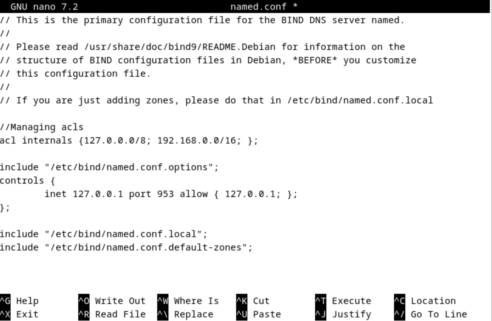
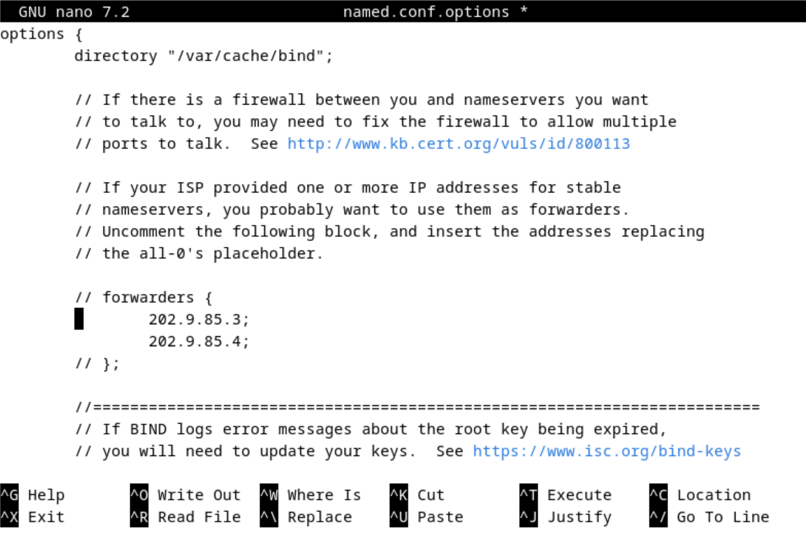
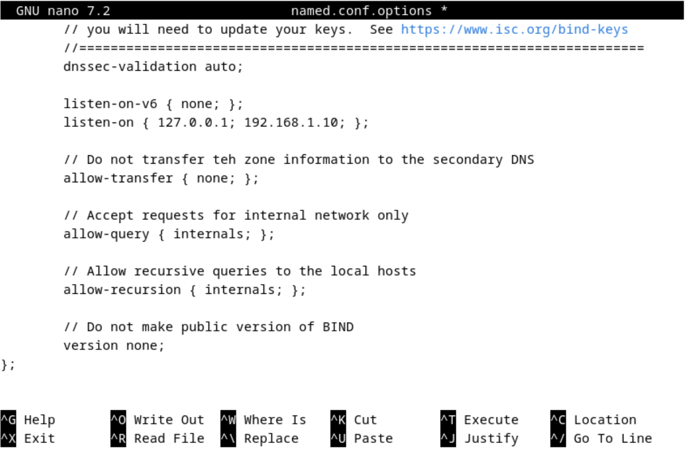
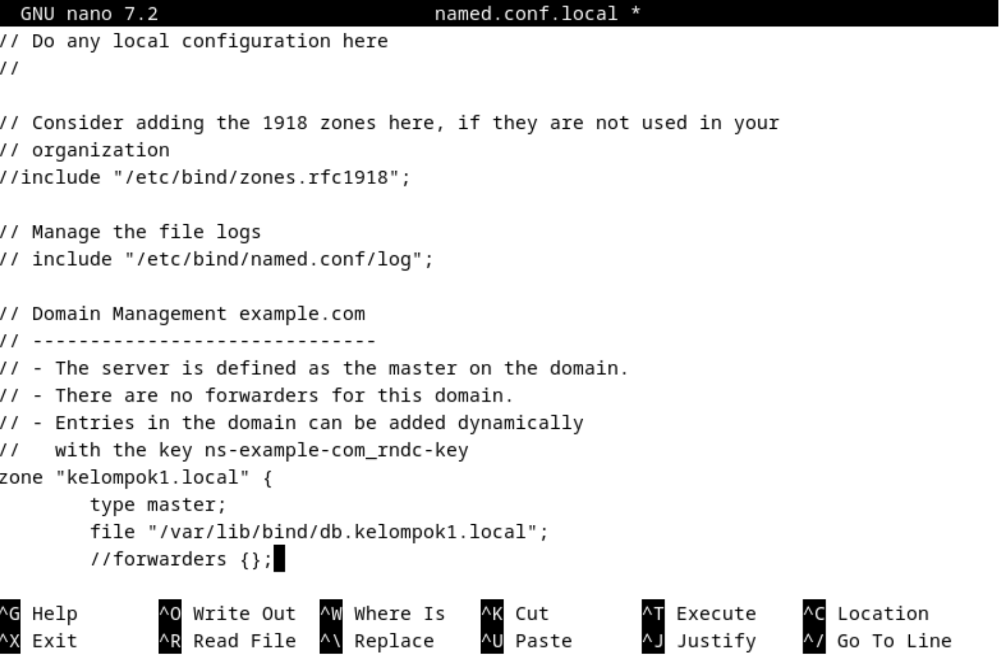
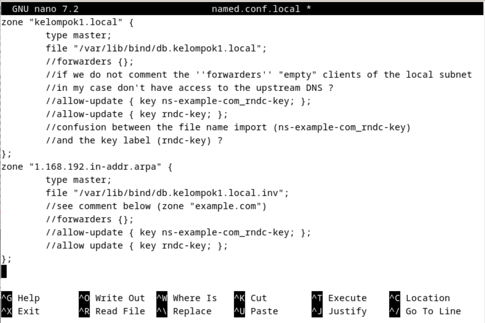
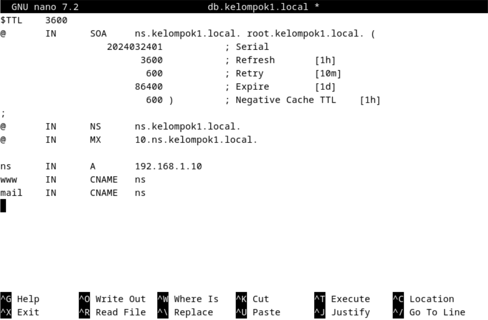
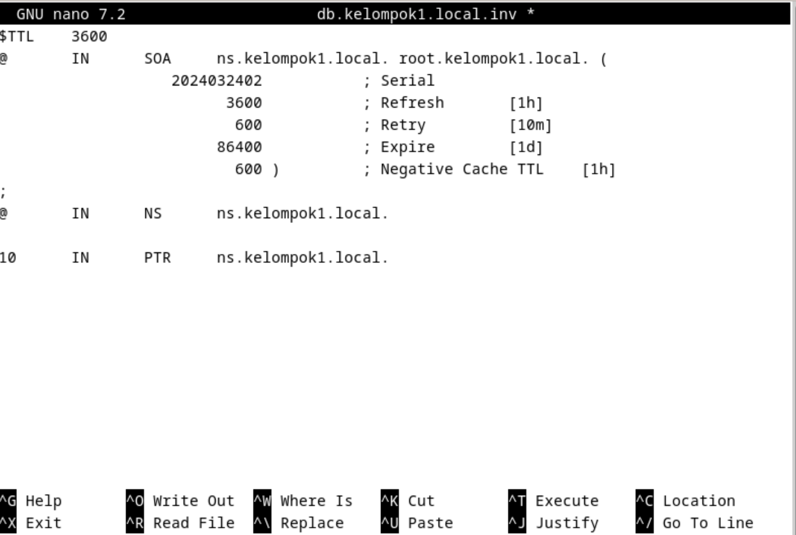
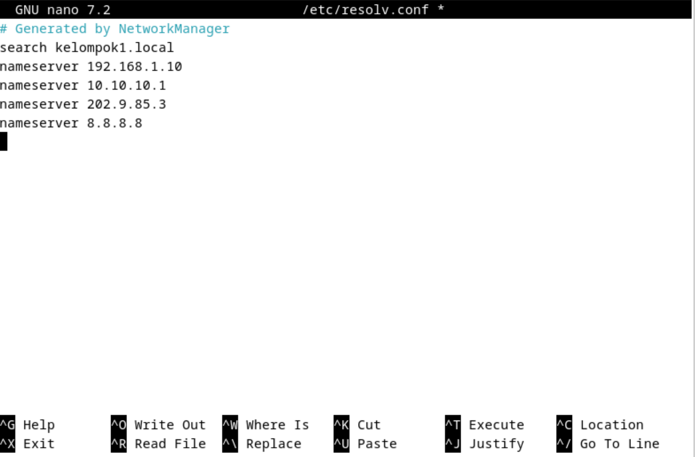

# Instalasi Bind9
Untuk dokumentasi dari bind9 dapat diakses melalui [Bind9 - Debian Wiki](https://wiki.debian.org/Bind9).

Berikut langkah-langkah instalasi dan konfigurasi dari bind9

`cd /var/lib/bind`
`sudo nano db.kelompok1.local`

`sudo nano db.kelompok1.local.inv`

`sudo nano /etc/resolv.conf`

