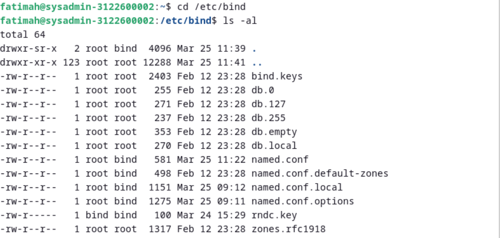

# Instalasi Bind9
Untuk dokumentasi dari bind9 dapat diakses melalui [Bind9 - Debian Wiki](https://wiki.debian.org/Bind9).

Berikut langkah-langkah instalasi dan konfigurasi dari bind9

### Install Bind9 beserta dokumentasinya dan dnsutils

### Konfigurasi file named
masuk ke direktori /etc/bind

Edit file named.conf menggunakan nano editor.

Edit file named.conf.options menggunakan nano editor.

Edit file named.conf.local menggunakan nano editor.

Buat 2 zone, zone pertama bernama kelompok1.local dan yang kedua 2.0.10.in-addr.arpa.

### Konfigurasi file db.kelompok
Masuk ke direktori /var/lib/bind untuk mengakses file db.kelompok1

Konfigurasikan file db.kelompok1.local. Isi serial dengan tanggal saat ini.

Konfigurasikan file db.kelompok1.local.inv. Isi serial dengan tanggal saat ini.

### Konfigurasi file resolv.conf
konfigurasikan file resolv.conf yang terdapat pada direkotri /etc

### Mengecek hasil konfigurasi dan zone
Pada saat mengecek konfigurasi menggunakan perintah `sudo named-checkconf`, ketika sudah benar semua, tidak ada yang dikembalikan dari perintah tersebut.

Sedangkan saat mengecek zone menggunakan perintah `sudo named-checkzone`, jika sudah benar maka akan muncul **OK** pada bagian akhirnya

### Melakukan systemctl restart dan mengecek status
Setiap kali setelah merubah file konfigurasi, lakukan restart seperti berikut.

Jiak proses restart sudah berhasil, maka tidak akan menampilkan apapun.

### Melakukan dig dan nslookup
Saat sudah benar semua konfigurasinya, kita dapat melakukan dig pada kelompok.local serta pada 10.0.2.15, dan juga dapat melakukan nslookup terhadap ns yang telah diset serta pada mail.

