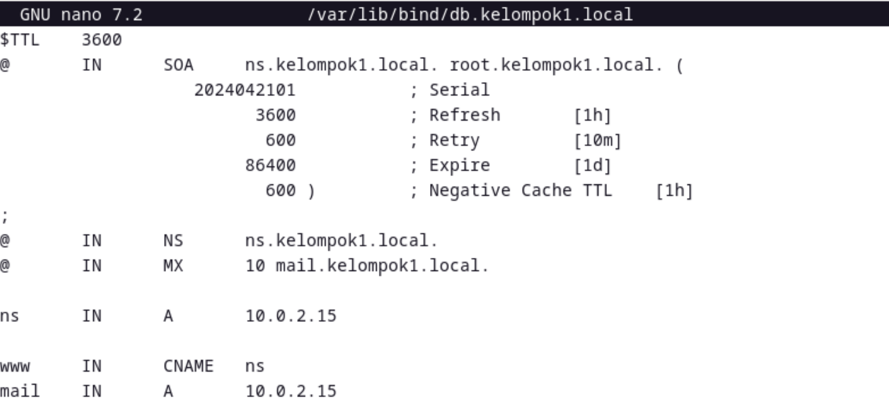
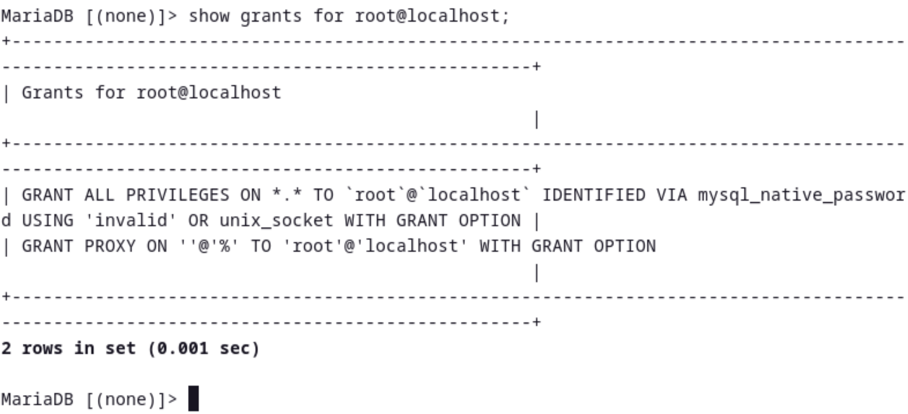
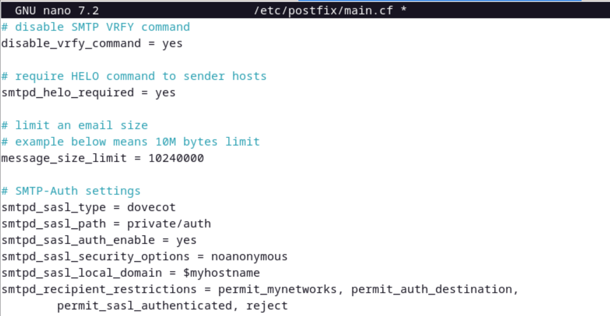
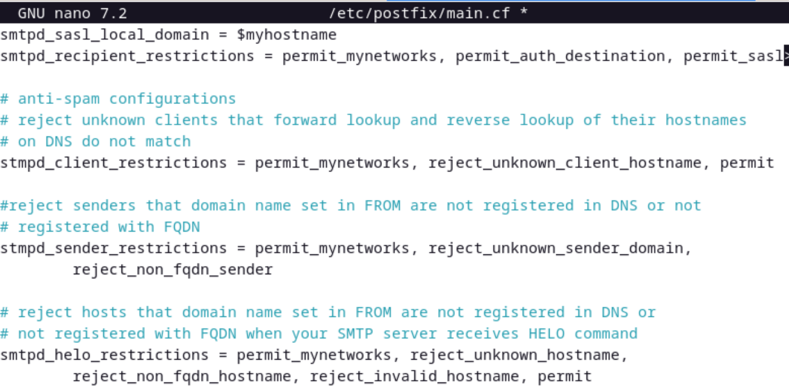

# NTP Client, Apache 2, PHP-FM, Mariadb-Server, Email System, DOVECOT

## Persiapan
1. Peratma-tama kita set up dulu mail server pada konfigurasi zone pada bind

2. Pastikan untuk melakukan restart pada system named

## NTP Client
1. Lakukan instalasi paket layanan sinkronisasi waktu

2. Konfigurasikan timezone ke Asia/Jakarta

3. Lakukann konfigurasi RTC untuk merefer ke UTC

4. Aktifkan NTP client untuk sikronisasi waktu

5. Edit file  timesyncd.conf untuk mengarah ke NTP server terdekat untuk mendapatkan delay waktu terpendek.

6. Restart layanan sikronisasi waktu dan cek statusnya

7. Lakukan pengecekan kesesuaian tanggal system

## Apache 2 & PHP-FM
1. Lakuakn instalasi apache2

2. Konfigurasikan apache2

3. Lakukan reload pada service apache2

4. Lakukan test di web browser

5. Install PHP 8.2

6. Cek apakah sudah terinstall beserta versinya

7. Buat file php dan jalankan untuk memeriksa apakah PHP sudah berjalan

8. Install PHP FM

9. Lakukan konfigurasi pada file Apache untuk PHP FM

10. Lakukan restart pada servicenya

11. Buat file info.php dan lakukan test pada web

## Mariadb Server
1. Lakukan instalasi Mariadb

2. Ubah charset ke utf8mb4, lalu restart service mariadb

3. Lakukan instalasi mysql

4. Masuk ek dalam perintah mysql dan lakukan langkah-langkah berikut

## POSTFIX mailserver(SMTP Server)
1. Install postfix

2. Pada saaat instalasi, pilih yang maunal

3. Salin isi file config /usr/share/postfix/main.cf.dist ke /etc/postfix/main.cf

4. Ubah beberapa isi dari file konfigurasi file postfix-main.cf

5. Buat newalias dan lakukan restart

6. Tambahkan konfigurasi anti-spam dan restart

## DOVECOT
1. Lakukan instalasi dovecot

2. Ubah listen IP-nya

3. Ubah file auth

4. Konfigurasikan file mail

5. Tambahkan mode 0666, dan user,group postfix pada file master

6. Lakukan restart pada service

7. Cek netstat

8. Lakukan test connection sebagai berikut

